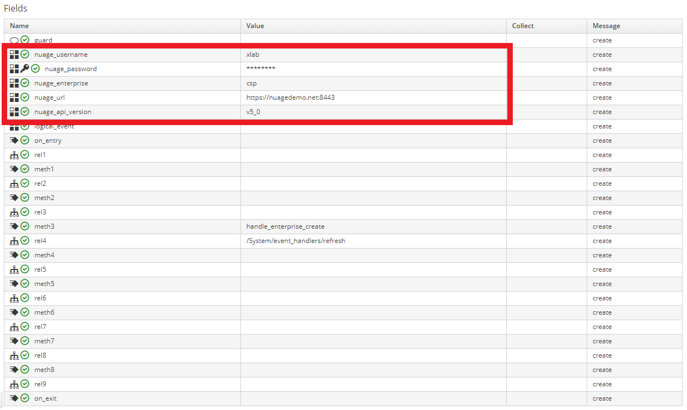

Ansible Role: nuage_miq_automate
=========

This role accesses ManageIQ Automation Workspace for you to provide you with
Nuage credentials (variable `nuage_auth`) and EMS event data (variable `event`).

- **Nuage credentials**. Format is exactly as required by
[Nuage Ansible module](https://docs.ansible.com/ansible/latest/modules/nuage_vspk_module.html#parameters)
so you can use it directly:
```yaml
nuage_auth:
  api_username: user
  api_password: pass
  api_enterprise: csp
  api_url: https://nuagedemo.net:8443
  api_version: v5_0
```

- **EMS event data**. This is where you access event details and use them for
whatever callback you want to run.
```yaml
event:
  #
  # EMS id that event was emitted for.
  #
  ems_id: '2'
  #
  # Event type (same as `full_data.type`).
  #
  type: CREATE
  #
  # Type of entity that event was raised for (same as `full_data.entityType`).
  #
  entityType: enterprise
  #
  # Entity that event was raised for (same as `full_data.entities[0]`).
  # 
  entity:
    entity_type: enterprise
    ID: 07f2726a-7f83-4826-87bd-7f7664803938
    name: DEMO3
    # ... and other attributes
  #
  # Entire event hash as received from Nuage server.
  #
  full_data:
    assoicatedEvent: false
    diffMap: 
    enterpriseName: csp
    entities:
    - entityType: enterprise
      ID: 07f2726a-7f83-4826-87bd-7f7664803938
      name: DEMO3
      # ...
    entityType: enterprise
    entityVersion: 
    eventReceivedTime: 1535011120658
    ignoreDiffInMediationEvents: false
    requestID: 62c58aa6-4150-46c7-95fe-ed4051e70864
    sourceEnterpriseID: 07f2726a-7f83-4826-87bd-7f7664803938
    type: CREATE
    updateMechanism: DEFAULT
    userName: xlab
```

Please see this [blogpost](https://tech.xlab.si/posts/nuage-ansible-in-automate/) to better
understand what the role is supposed to do. There is also a
[YouTube video](https://www.youtube.com/watch?v=YeXtnjTY67s) with a full demonstration
of its usage.

Requirements
------------

You need to have following Attributes defined on your Automate Instance which is
running nuage_miq_automate role:

- `nuage_username` e.g. *user*
- `nuage_password` (encrypted) e.g. *pass*
- `nuage_enterprise` e.g. *csp*
- `nuage_url` e.g. *ht<span>tps://nuagedemo.net:8443*
- `nuage_api_version` e.g. *v5_0*



Main purpose of this role is to extract these Attributes out of Automation Workspace.

*NOTE: You don't really need to specify the five Attributes on every Automate Instance.
Instead, you can just modify Schema and set **default values** there -
then all Instances of a Class will be able to access them. This way, should your
credentials change, you will only need to update those default values.*

Role Variables
--------------

| Variable            | Default | Description |
|---------------------|---------|-------------|
| manageiq            | /       | Set by Automate.
| manageiq_connection | /       | Set by Automate.


```yaml
manageiq:
  X_MIQ_Group: Tenant My Company access
  api_token: 2d5d9031361a6ac570d810406f267cea
  api_url: 'http://localhost:4000'
  automate_workspace: automate_workspaces/82632486-7529-45c6-8fa7-fc53ebbb157d
  group: groups/1
  user: users/1
manageiq_connection:
  X_MIQ_Group: Tenant My Company access
  token: 2d5d9031361a6ac570d810406f267cea
  url: 'http://localhost:4000'
```

You shouldn't need to worry about role inputs because ManageIQ Automate will provide
them for you.

Outputs
-------
This role sets following variables for you:

| Stats name       | Description |
|------------------|-------------|
| nuage_auth       | Nuage authentication hash. Can be passed to nuage_vspk module directly.
| event            | EMS event data, see below.
| object           | Current Automate Instance absolute name.

```yaml
event:
  type:        CREATE
  ems_id:      4
  entity_type: subnet
  full_data:   { ... } # full event data as emitted by Nuage provider
  entity:      { ... } # event['entities'].first
```

Dependencies
------------

This role requires following roles that are also available on Ansible Galaxy:

- [syncrou.manageiq-automate](https://galaxy.ansible.com/syncrou/manageiq-automate)
- [syncrou.manageiq-vmdb](https://galaxy.ansible.com/syncrou/manageiq-vmdb)

Example Playbook
----------------

Suppose we want to create a DomainTemplate everytime a new Enterprise is created.
We simply need to hook such playbook:

```yaml
- name: Nuage event callback example
  hosts: localhost
  connection: local
  gather_facts: False
  roles:
  - xlab_si.nuage_miq_automate
  tasks:
  - debug: msg="I am a playbook running as event callback and I am able to access nuage credentials"
  - debug: var=nuage_auth
  - debug: msg="As well as details of the event that triggered me"
  - debug: var=event
  - debug: msg="So I'm now ready to do some work!"
  
  - name: Create Domain Template on Enterprise
    delegate_to: localhost
    nuage_vspk:
      auth: "{{ nuage_auth }}"          # notice how we just pass forward the `nuage_auth`
      type: DomainTemplate
      parentType: Enterprise
      parentId: "{{ event.entity.ID }}" # notice how we just access the `event` variable
      state: present
      properties:
        name: "Demo Domain Template"
```

to the `nuage_enterprise_create` event. Tadaaa :)

License
-------

BSD
